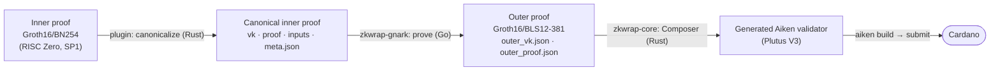

# plutus-groth16-wrapper

> ### ⚠️ Important Disclaimer & Acceptance of Risk
>
> **This repository contains prototype implementations.** This code is provided "as is" for research and educational purposes 
> only. It has not been thoroughly tested and audited and is not intended for production use. By using this code, you 
> acknowledge and accept all associated risks, and our company disclaims any liability for damages or losses.

A toolkit for verifying **Groth16/BN254** proofs on **Cardano**. Most of the external ZK ecosystem (RISC Zero, SP1, circom, Ethereum tooling) produces proofs over BN254, but Cardano natively supports only BLS12-381 via [CIP-0381](https://cips.cardano.org/cip/CIP-0381). This curve mismatch leaves Cardano cut off from the broader zkVM ecosystem — there is no practical path today to verify a RISC Zero or SP1 proof on-chain.

This project closes that gap. It re-proves a Groth16/BN254 statement inside a BLS12-381–friendly circuit off-chain, and generates a matching [Aiken](https://aiken-lang.org/) verifier that runs as a Plutus V3 script. The intent is snarkjs-level ergonomics: a developer with a Groth16/BN254 proof should be able to wrap it and verify it on Cardano with minimal tooling friction.

> **Status:** early implementation. Architecture and tooling form factor are still being worked out. See [docs/initial-proposal.md](docs/initial-proposal.md) for the full proposal and [docs/implementation-plan.md](docs/implementation-plan.md) for the phased roadmap.

## Architecture

The pipeline takes an external Groth16/BN254 proof to an on-chain Cardano verification in four hops — three off-chain (Rust + Go), one on-chain (Aiken/Plutus V3):

Because Plutus V3 supports BLS12-381 (CIP-0381) but not BN254 pairings, the BN254 proof is **re-proved inside a BLS12-381 wrapper circuit** off-chain; the on-chain script verifies that wrapper proof. Its public inputs are `[InnerVKHash, input₀ … input₇]`, so the check reduces to *"a pinned inner VK accepted these inputs."*

### Two-axis codegen

The on-chain verifier is not hand-written per system — it is **composed** from two independent, pluggable axes:

- **Outer layer** — the proving-engine verifier (Groth16/BLS12-381 today, PLONK later), keyed by the outer backend; generic across inner systems.
- **Inner layer** — the zkVM-specific scaffolding (e.g. RISC Zero's journal-authentication chain), keyed by `system_id`; knows nothing of the outer proof.

A **Composer** in `zkwrap-core` stitches one of each into a ready-to-`aiken check` project.

### Repository map

| Path | Role |
|---|---|
| `zkwrap-gnark/` (Go) | Outer prover binary (`unsafe-setup`, `prove`, `verify`) — wraps a canonical inner proof into a BLS12-381 outer proof via gnark. |
| `zkwrap-rs/zkwrap-core` (Rust) | Codegen engine: the Composer, the `OuterCodegen`/`InnerCodegen` traits, the gnark-groth16 outer backend (artifacts + Aiken template + VK-hash cross-check), and the BN254 inner-proof contract. |
| `zkwrap-rs/zkwrap-risc0`, `zkwrap-sp1` | Per-system plugins: inner-layer Aiken codegen (and, in progress, native-receipt → canonical-proof conversion). |
| `docs/` | `adr/` decisions · `schemas/` data contracts · `research/` notes · `journal.md` log. |
| `experiments/` | Exploratory spikes (e.g. the hand-written Aiken verifier the generator was lifted from). |

## License

Copyright 2026 Input Output Global

Licensed under the Apache License, Version 2.0 (the "License"). You may not use this repository except in compliance
with the License. You may obtain a copy of the License at http://www.apache.org/licenses/LICENSE-2.0

Unless required by applicable law or agreed to in writing, software distributed under the License is distributed on an 
"AS IS" BASIS, WITHOUT WARRANTIES OR CONDITIONS OF ANY KIND, either express or implied. See the License for the specific
language governing permissions and limitations under the License
